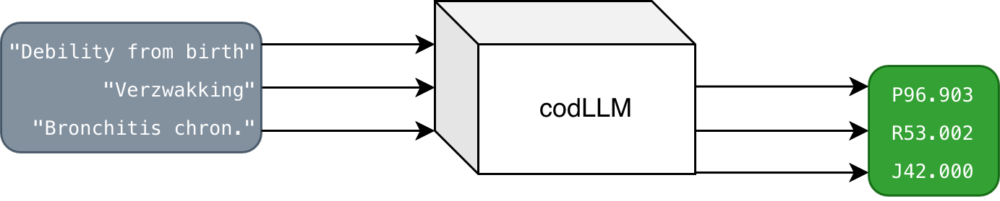

# Coding Historical Causes of Death with Large Language Models

codLLM trains and evaluates transformer models for mapping historical free-text causes of death to ICD10h labels. The
main runtime is the `codllm` Python package under `src/`, with entrypoints for training and inference, TOML experiment
specs under `runs/`, and invoke tasks for local and LSF/HPC workflows.



## Project Scope

Historical cause-of-death coding is usually manual, slow, and dependent on specialist knowledge. codLLM makes this work
repeatable by standardizing source datasets, harmonizing ICD10h labels, preparing train/validation/test and hold-out
splits, fine-tuning Hugging Face models, and logging model behavior and data diagnostics.

The repository does not include the historical datasets. Raw data and the ICD10h masterlist must be supplied separately
under `data/raw/` or through `CODLLM_DATA_RAW_DIR`.

## Quick Start

Requirements:

- Python 3.13
- `uv`
- raw dataset files in `data/raw/` for training
- a Hugging Face token for private models or rate-limited downloads
- an optional W&B API key for experiment tracking

Install the project:

```bash
git clone https://github.com/murrodroid/codllm
cd codllm
uv sync
```

Set credentials permanently in your shell environment:

```zsh
SHELL_RC="$HOME/.profile"
case "$(basename "${SHELL:-}")" in
  zsh) SHELL_RC="${ZDOTDIR:-$HOME}/.zshrc" ;;
  bash) SHELL_RC="$HOME/.bashrc" ;;
esac

cat <<'EOF' >> "$SHELL_RC"

export HF_TOKEN="..."
export WANDB_API_KEY="..."
EOF

source "$SHELL_RC"
```

Run tests:

```bash
uv run pytest tests/
```

Run local training directly from environment/config defaults:

```bash
uv run python -m codllm.training
```

Run one TOML experiment spec locally:

```bash
uv run invoke train --config runs/single/base_small.toml
```

The checked-in specs target the project workflow, and several inherit H100 batch-size defaults. Adjust batch sizes,
dataset size, and epochs before running them on smaller local hardware.

For a local smoke run, override the expensive settings in your shell before training, for example:

```bash
export CODLLM_DATASET_SIZE=0.01
export CODLLM_NUM_TRAIN_EPOCHS=1
export CODLLM_PER_DEVICE_TRAIN_BATCH_SIZE=4
export CODLLM_PER_DEVICE_EVAL_BATCH_SIZE=4
export CODLLM_WANDB_MODE=disabled
uv run python -m codllm.training
```

## Data Inputs

Default source configuration lives in `Config.data_sources` in `src/codllm/settings/schema.py`. By default, codLLM
expects these files below `data/raw/`:

| Purpose | Filename |
| --- | --- |
| ICD10h masterlist and transfer sheet | `ICD10h_Masterlist_2024.xlsx` |
| Belgium | `SOSA_EXTR_1920-1930 (belgium).xlsx` |
| Amsterdam | `AMC_1854_1926_LM.csv` |
| Copenhagen | `Copenhagen_burials_all_May2025.csv` |
| Ipswich | `Ipswich_deaths_codllm.txt` |
| Madrid | `Madrid 1905_1927.csv` |
| Historic strings | `ICD10H_HISTORICSTRINGSENGLISH_2024.2.xlsx` |

Processed rows are written to `Config.data_processed_dir` as `data.parquet` by default. The processed schema includes
`source_id`, `record_id`, `source_path`, the configured text column, `y_codes`, and the configured label column.

Processed-data caches are validated against source file signatures, source mappings, label harmonization settings, input
fields, and label settings. Prepared split caches live beside the processed file under:

```text
<processed-stem>.splits/<cache-key>/
```

Those split caches include split-time transformations such as hold-out removal, multi-COD synthesis, balancing, and
masterlist injection.

Inspect cache usage:

```bash
uv run invoke maintenance.data-cache
uv run invoke maintenance.data-cache --profile h100-10h
```

Clear processed-data and prepared-split caches with a dry run first:

```bash
uv run invoke maintenance.clear-data-cache
uv run invoke maintenance.clear-data-cache --yes
```

The cache clearer never targets raw datasets. Lock files are kept by default; pass `--locks` only when no training or
cache-build jobs are active.

For broader cleanup, inspect storage first:

```bash
uv run invoke maintenance.status
uv run --no-sync invoke maintenance.status --lucas
```

Then run one of the broad cache policies:

```bash
uv run invoke maintenance.clear-cache --standard
uv run invoke maintenance.clear-cache --standard --days 30 --yes
uv run invoke maintenance.clear-cache --aggressive
```

`--standard` targets maintenance-managed generated paths unused for 14+ days by default. `--aggressive` targets all
maintenance-managed generated paths regardless of age. Both modes dry-run unless `--yes` is passed. Broad cleanup may
remove processed-data caches, prepared split caches, local run/checkpoint directories, generated LSF submissions, logs,
Python/tool caches, and explicit runtime caches such as Hugging Face, torch, W&B, and uv cache paths. It still protects
raw datasets, source code, tracked TOML specs, arbitrary files under `models/`, and generic profile cache roots that are
not clearly owned by codLLM.

Maintenance cache and status tasks accept the same LSF profile context used by HPC submission. Pass `--profile h100-10h`
to inspect that profile's storage layout, or pass `--lucas` to use the default H100 profile with Lucas's DTU work folder
resolved as `/work3/s234805` and run storage as `/work3/s234805/codllm`. Profiles with a known notification email also
auto-resolve `$USER` storage placeholders, so `--profile h100-10h` resolves to Lucas's work folder even when run from a
local machine whose shell user is not `s234805`.

## Repository Layout

```text
codLLM/
|-- AGENTS.md                       # Agent instructions and project conventions
|-- README.md
|-- pyproject.toml                  # Python package metadata and dependencies
|-- uv.lock
|-- tasks.py                        # Invoke tasks for local, experiment, and HPC workflows
|-- src/codllm/
|   |-- training/                   # Training CLI, stages, Trainer setup, W&B logging
|   |-- inference/                  # Inference CLI, IO, generation, decoding
|   |-- maintenance/                # Dataset cache, HPC env, and git hygiene helpers
|   |-- settings/                   # Config dataclasses, env parsing, option types
|   |-- input/                      # Source mappings, raw loaders, harmonization, multi-COD
|   |-- data/                       # DataHandler, caches, splits, balancing, tokenization
|   |-- experiments/                # TOML specs and LSF submission rendering
|   |-- labels/                     # ICD10h schemas and registry helpers
|   |-- models/                     # Hugging Face model loading
|   `-- runtime/                    # Paths and reproducibility helpers
|-- runs/
|   |-- base/                       # Reusable H100 runtime bases
|   |-- single/                     # Single-run experiment specs
|   `-- sweeps/                     # Cartesian sweep specs
|-- hpc/
|   |-- env.sh                      # HPC storage/cache bootstrap
|   |-- lsf_profiles.toml           # Named LSF resource profiles
|   `-- storage-check.sh
|-- data/
|   |-- raw/                        # User-supplied raw data, not committed
|   `-- processed/                  # Local processed caches, not committed
|-- visualizations/                 # README and project figures
|-- experiments/                    # Notebooks and tree-search experiments
|-- dockerfiles/
|   `-- train.dockerfile
|-- tests/
`-- jobs/generated/                 # Created by hpc.submit; ignored by git
```

## Experiment Specs

Experiment specs are TOML files. They can inherit from base specs, set shared environment values in `[env]`, and define
cartesian sweeps in `[sweep]`.

```toml
base = "../base/h100-large.toml"
name = "example-large-run"
command = "train"
force_reprocess = false

[env]
CODLLM_LR = 2.5e-5
CODLLM_NUM_TRAIN_EPOCHS = 8
CODLLM_SAVE_STRATEGY = "no"

[sweep]
CODLLM_LR_SCHEDULER_TYPE = ["cosine", "linear"]
```

TOML booleans become `1` or `0`, arrays in `[env]` become comma-separated strings, and arrays in `[sweep]` expand into
one run per cartesian combination. Sweep runs also get generated W&B grouping metadata unless explicitly overridden:
`WANDB_SWEEP_ID=codllm-<experiment-name>` and `WANDB_RUN_GROUP=<experiment-name>`.

Useful commands:

```bash
uv run invoke --list
uv run invoke experiments.list
uv run invoke experiments.plan --config runs/sweeps/pretraining.toml --profile h100-10h
```

Checked-in specs:

| Spec | Purpose |
| --- | --- |
| `runs/profiles/h100-small.toml` | H100 runtime profile for `google/flan-t5-small` |
| `runs/profiles/h100-base.toml` | H100 runtime profile for `google/flan-t5-base` |
| `runs/profiles/h100-large.toml` | H100 runtime profile for `google/flan-t5-large` |
| `runs/profiles/h100-xl.toml` | H100 runtime profile for `google/flan-t5-xl` |
| `runs/single/size_sweep_{small,base,large,xl}.toml` | Identical-contract size-sweep baselines (effective batch 32 across sizes) |
| `runs/single/base_small.toml` | Current single-run baseline with multi-COD, balancing, and pretraining enabled |
| `runs/sweeps/pretraining.toml` | Masterlist pretraining on/off |
| `runs/sweeps/multicod_pretrain.toml` | Synthetic multi-COD masterlist pretraining ratio |
| `runs/sweeps/multicod.toml` | Multi-COD synthetic fine-tuning ratio with the large H100 base |
| `runs/sweeps/holdout.toml` | Leave-one-source-out evaluation |
| `runs/sweeps/scheduler.toml` | LR scheduler comparison |
| `runs/sweeps/training_inputs.toml` | COD-only input vs COD+age+sex input |

## HPC Usage

The recommended HPC path is invoke-driven and does not require Docker. Experiment intent stays in `runs/**/*.toml`,
cluster resources stay in `hpc/lsf_profiles.toml`, and generated LSF files are written under `jobs/generated/`.

On an HPC login node, source the storage bootstrap before any `uv` command:

```bash
source hpc/env.sh
bash hpc/storage-check.sh
uv sync --frozen --no-dev
uv run --no-sync invoke hpc.storage
```

`hpc/env.sh` moves uv, Python, Hugging Face, torch, and W&B caches under `$RUN_STORAGE_DIR` instead of personal user
space. After the first successful sync, prefer `uv run --no-sync invoke ...` for planning and submission.

List configured LSF profiles:

```bash
uv run --no-sync invoke hpc.profiles
```

The default profiles are `h100-2h` through `h100-10h`, `h100-24h`, and `v100`. H100 profiles request 17 CPU cores so
training specs can use 16 DataLoader workers plus the main process.

Inspect a concrete experiment plan:

```bash
uv run --no-sync invoke experiments.plan \
  --config runs/single/base_small.toml \
  --profile h100-10h
```

Prebuild reusable processed-data and prepared-split caches:

```bash
uv run --no-sync invoke hpc.build \
  --config runs/single/base_small.toml \
  --profile h100-10h
```

For sweep specs, `hpc.build` builds every expanded run by default. Build one run with a one-based sweep index:

```bash
uv run --no-sync invoke hpc.build \
  --config runs/sweeps/multicod_pretrain.toml \
  --profile h100-10h \
  --sweep-index 2
```

Generate an LSF job without submitting it:

```bash
uv run --no-sync invoke hpc.submit \
  --config runs/sweeps/pretraining.toml \
  --profile h100-10h \
  --user lucas \
  --dry-run
```

Submit the generated job:

```bash
uv run --no-sync invoke hpc.submit \
  --config runs/sweeps/pretraining.toml \
  --profile h100-10h \
  --user lucas
```

`--user` currently supports `lucas` and `elias` for LSF notification email selection. Sweep specs render as LSF job
arrays with one generated env file per array index. The generated job script sets storage/cache defaults, loads profile
modules, runs `uv sync --frozen --no-dev` under a lock unless `SYNC_ENV=0`, and launches either training or inference
from the generated run environment.

HPC defaults:

- raw data: `$PROJECT_DIR/data/raw`
- processed data: `$RUN_STORAGE_DIR/data/processed`
- model outputs: `$RUN_STORAGE_DIR/runs`
- generated scripts/env files/manifests: `jobs/generated/`
- logs: `logs/`

Use the maintenance checks before long HPC runs or before pushing a branch:

```bash
uv run invoke maintenance.status
uv run --no-sync invoke maintenance.status --profile h100-10h
uv run --no-sync invoke maintenance.hpc-env --lucas
uv run invoke maintenance.git-hygiene
uv run invoke maintenance.git-snapshot
```

`maintenance.git-snapshot` writes a local `logs/git/` status and recent-commit record. `logs/` is ignored by git, so
cluster stdout/stderr logs and local snapshots do not get pushed accidentally.
`maintenance.status` shows disk capacity for the workspace, profile/home, and configured HPC storage roots, then breaks
known codLLM usage into code, raw datasets, processed datasets/splits, model outputs, generated jobs/logs, runtime
caches, and Python/tool caches. For Lucas's H100 profiles, `maintenance.status --profile h100-10h` and
`maintenance.status --lucas` report the managed HPC roots under `/work3/s234805/codllm`.

## Training Options

All runtime behavior is owned by `Config` in `src/codllm/settings/schema.py` and environment overrides in
`src/codllm/settings/env.py`. Prefer setting options in TOML specs rather than editing code.

### Model Size and Task

- `CODLLM_HF_MODEL` selects a Hugging Face model id or local checkpoint path.
- `runs/profiles/h100-small.toml` uses `google/flan-t5-small`.
- `runs/profiles/h100-large.toml` uses `google/flan-t5-large`.
- `CODLLM_MODEL_TASK=seq2seq` is the default and supports single-label and multi-COD targets.
- `CODLLM_MODEL_TASK=sequence_classification` uses `AutoModelForSequenceClassification` and currently requires
  `CODLLM_MAX_LABEL_COUNT=1`.
- `CODLLM_TORCH_DTYPE` accepts `auto`, `float16`, `bfloat16`, or `float32`.
- `CODLLM_LOAD_IN_8BIT=1` is supported for model loading on CUDA, but the current full fine-tuning path rejects
  quantized trainable models.

### Input Fields and Labels

- `CODLLM_TRAINING_INPUT` controls the processed input fields: `cod`, `age`, and `sex`.
- `CODLLM_INPUT_PREFIX_COD`, `CODLLM_INPUT_PREFIX_AGE`, and `CODLLM_INPUT_PREFIX_SEX` control text prefixes.
- `CODLLM_TEXT_FIELD_SEPARATOR` joins input fields.
- `CODLLM_LABEL_SEPARATOR` joins multi-label targets.
- `CODLLM_MAX_LABEL_COUNT` controls how many ICD10h labels a row may carry.
- `CODLLM_MAX_TARGET_LENGTH`, `CODLLM_LABEL_CODE_LENGTH`, and `CODLLM_MAX_TARGET_LENGTH_BUFFER` control target
  generation length; the effective target length is raised automatically when multi-label targets need more room.

### Label Harmonization

Label harmonization is enabled by default. It loads the configured ICD10h masterlist workbook, maps 2020 labels through
the transfer sheet, normalizes labels to the `A00.000` shape, and drops rows whose labels are absent from the
masterlist.

Main controls:

- `CODLLM_LABEL_HARMONIZATION_ENABLED`
- `CODLLM_LABEL_HARMONIZATION_MASTERLIST_PATH`
- `CODLLM_LABEL_HARMONIZATION_MASTERLIST_SHEET_NAME`
- `CODLLM_LABEL_HARMONIZATION_TRANSFER_SHEET_NAME`

### Masterlist Pretraining

Set `CODLLM_PRETRAIN_ENABLED=1` to run a two-stage flow: pretrain on ICD10h masterlist strings, then fine-tune on the
prepared historical splits. Pretraining has separate learning-rate, warmup, scheduler, epoch, evaluation, upsampling,
and synthetic multi-COD controls, so it does not reuse fine-tuning knobs by accident.

Common controls:

- `CODLLM_PRETRAIN_MASTERLIST_PATH`
- `CODLLM_PRETRAIN_NUM_TRAIN_EPOCHS`
- `CODLLM_PRETRAIN_LEARNING_RATE`
- `CODLLM_PRETRAIN_WARMUP_RATIO`
- `CODLLM_PRETRAIN_LR_SCHEDULER_TYPE`
- `CODLLM_PRETRAIN_EVAL_EVERY_N_EPOCHS`
- `CODLLM_PRETRAIN_UPSAMPLE_ENABLED`
- `CODLLM_PRETRAIN_UPSAMPLE_TARGET_PER_LABEL`
- `CODLLM_PRETRAIN_UPSAMPLE_PERTURBATIONS`
- `CODLLM_PRETRAIN_UPSAMPLE_PERTURBATIONS_PER_SAMPLE`
- `CODLLM_PRETRAIN_MULTICOD_SYNTHETIC_RATIO`
- `CODLLM_PRETRAIN_MULTICOD_SYNTHETIC_TEXT_SEPARATOR`

### Multi-COD

Multi-COD training is enabled by setting `CODLLM_MAX_LABEL_COUNT` above `1`. For seq2seq runs, target labels are emitted
as separator-joined ICD10h strings.

Controls:

- `CODLLM_MULTICOD_SHUFFLE_LABELS` shuffles multi-label target order deterministically from the data seed.
- `CODLLM_MULTICOD_SYNTHETIC_RATIO` creates training-only synthetic multi-COD rows from eligible single-COD rows.
- `CODLLM_MULTICOD_SYNTHETIC_SOURCE_SCOPE` is `within_source` by default; `any_source` is opt-in.
- `CODLLM_MULTICOD_SYNTHETIC_TEXT_SEPARATOR` joins merged cause strings.

Synthetic multi-COD rows are added only after train/validation/test splitting, and only to the training split.

### Balancing and Perturbation

Balancing is a training-split transformation. It never changes validation, test, or final hold-out rows.

The pipeline has two independent stages. Floor upsampling uses `CODLLM_BALANCE_*`; whole-training-set base
perturbation uses `CODLLM_BASE_PERTURBATION_*`. Either or both may be active in a single run; setting
`CODLLM_BALANCE_STRATEGY=none` and `CODLLM_BASE_PERTURBATION_RATE=0` disables both.

#### Stage 1 — Floor upsampling (`CODLLM_BALANCE_STRATEGY=floor`)

Every class with fewer than `CODLLM_BALANCE_FLOOR` samples is upsampled by drawing additional rows from the same class
until the floor is reached. The new rows are perturbed proportionally — the more aggressive the upsample, the more
likely each synthetic copy is to be perturbed (so a class that was 10× upsampled receives noisier copies than one that
was only doubled). `CODLLM_BALANCE_FLOOR_DECAY` softens the floor for the rarest classes via a log curve so a class
with 1 original sample still ends up smaller than a class with 5 originals after upsampling — the natural ranking is
preserved. Set `_DECAY=0` for a strict floor.

Worked example with `FLOOR=50, DECAY=0`:

| Original count | Target after upsampling |
|---|---|
| 1 | 50 |
| 5 | 50 |
| 49 | 50 |
| 50 | 50 (unchanged) |
| 200 | 200 (unchanged) |

#### Stage 2 — Base-rate perturbation (`CODLLM_BASE_PERTURBATION_RATE > 0`)

After upsampling, a configurable fraction of the *entire training set* (synthetic + original) is perturbed in place.
This is regularization, not balance correction — `RATE=0.0` is the safe default, `RATE=1.0` perturbs every row. The
2026-04 sweep on flan-t5-small showed `RATE=1.0` hurts macro_f1 by ~5.7pp because the model never sees clean training
text but is evaluated on clean text. Reach for low rates (0.05 – 0.3) when you want regularization without distribution
shift.

#### Perturbation mechanics

Perturbations are applied only to the configured `cod` segment of the training text — never to age, sex, or other
metadata fields, so structural metadata stays intact across synthetic copies.

- `CODLLM_BALANCE_PERTURBATIONS` — comma-separated names from {`swap_adjacent_chars`, `delete_random_char`,
  `insert_random_whitespace`, `accent_random_vowel`, `qwerty_misspell`}. Applies to floor-upsampled copies.
- `CODLLM_BALANCE_PERTURBATION_MEAN` and `_VARIANCE` — control edits for floor-upsampled copies.
- `CODLLM_BASE_PERTURBATIONS`, `CODLLM_BASE_PERTURBATION_MEAN`, and `_VARIANCE` — equivalent controls for the
  whole-training-set regularization pass.
  Counts scale with COD text length, so longer cause strings receive more edits on average.

### Hold-Out Evaluation

Set `CODLLM_HOLD_OUT_DATASET` to a processed `source_id` for leave-one-source-out evaluation. Matching rows are removed
before dataset sampling and train/validation/test splitting. After training, the full held-out source is evaluated with
`holdout_test` metrics.

During-training hold-out evaluation is optional:

- `CODLLM_HOLD_OUT_EVALUATE_PER=epoch|steps`
- `CODLLM_HOLD_OUT_EVALUATE_RATIO=0.05`

The during-training callback evaluates a deterministic sample of the held-out source. The final post-training hold-out
evaluation always uses the full held-out source.

Default source ids:

- `belgium_1920_1930`
- `amsterdam_1854_1926`
- `copenhagen_may2025`
- `ipswich_1871_1911`
- `madrid_1905_1927`
- `historic_strings_en_2024`

### Masterlist Injection

`CODLLM_MASTERLIST_INJECT_ENABLED=1` injects masterlist-derived rows into the training split after balancing. This is
separate from pretraining and has its own target-per-label and perturbation controls:

- `CODLLM_MASTERLIST_INJECT_TARGET_PER_LABEL`
- `CODLLM_MASTERLIST_INJECT_PERTURBATIONS`
- `CODLLM_MASTERLIST_INJECT_PERTURBATIONS_PER_SAMPLE`

## Outputs and Metrics

Each training run writes checkpoints under a run-scoped output directory. Locally this becomes `runs/run-0001`,
`runs/run-0002`, and so on. On LSF, run ids use `LSB_JOBID` and `LSB_JOBINDEX`.

When W&B credentials are available, training logs:

- compact run-page config selected by `CODLLM_WANDB_RUN_CONFIG_MODE=minimal|standard|full`
- full resolved config, runtime metadata, source metadata, and training args as run metadata artifacts
- source file metadata and processed-cache fingerprints
- split sizes, source distributions, and label summaries
- compact data visualizations under `data/*`
- validation, test, hold-out, and pretraining metrics under scoped namespaces, filtered by
  `CODLLM_WANDB_METRIC_MODE=core|standard|all`
- full evaluation metrics and row-level predictions as artifacts, plus compact error tables under scopes such as
  `val/errors/*`, `test/errors/*`, and `holdout/test/errors/*`

Multi-COD runs emit exact-match, micro, sample, Jaccard, Hamming, and label-count diagnostics. Single-label runs emit
accuracy and macro precision/recall/F1.

## Inference

Run inference through the package entrypoint:

```bash
uv run python -m codllm.inference data/inference/input.csv \
  --hf-model runs/run-0001/checkpoint-500 \
  --output-path runs/inference/predictions.csv
```

For pretraining-enabled runs, use a checkpoint from the final `finetune/` stage.

Input formats:

- `.txt`: one example per line
- `.csv`, `.tsv`, `.jsonl`, `.parquet`: must contain the configured text column, `text` by default

Output formats are selected by extension: `.csv`, `.tsv`, `.jsonl`, or `.parquet`. Without `--output-path`, predictions
are written as compact JSONL to stdout.

Useful inference flags:

- `--hf-model` overrides `CODLLM_HF_MODEL` with a model id or local checkpoint path.
- `--model-task seq2seq|sequence_classification` overrides the configured task.
- `--validate-registry` rejects predicted codes absent from the configured ICD10h masterlist.

The matching environment variable for registry validation is `CODLLM_INFERENCE_VALIDATE_REGISTRY=1`.

## Docker

Docker is mainly for local containerized training, not the recommended HPC path.

```bash
docker build -f dockerfiles/train.dockerfile -t codllm-train:latest .
```

```bash
docker run --rm \
  -v codllm-runs:/app/runs \
  -v codllm-processed:/app/data/processed \
  -v "$PWD/data/raw:/app/data/raw:ro" \
  -e HUGGINGFACE_HUB_TOKEN \
  -e WANDB_API_KEY \
  codllm-train:latest
```

## Development Commands

```bash
uv run pytest tests/
uv run ruff format .
uv run ruff check . --fix
uv run invoke --list
```

The GitHub Actions test workflow runs `uv sync --frozen --all-groups` and `uv run pytest tests/ -q` on Linux.

## License

This repository is licensed under the MIT License.

The historical datasets used for training and evaluation are not public and require separate agreements with the data
providers.
